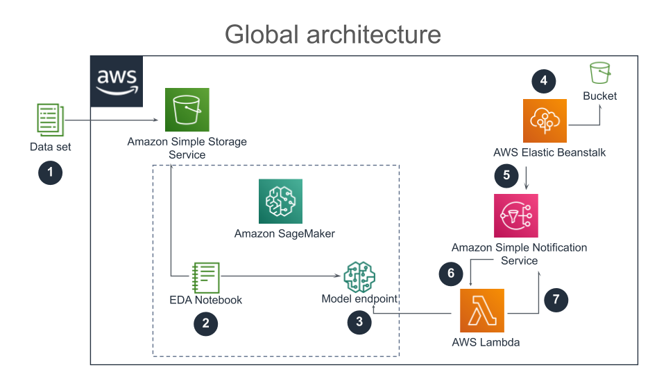

# Fraud detection

> Jedha Data Science Bootcamp 

> #dsen-paris-04 - 

## Machine learning using AWS Sagemaker

In this project I use the [Paysim dataset](https://www.kaggle.com/ntnu-testimon/paysim1).

My goal is to create a model predicting whether or not a mobile payment is fraudulent.

I split the dataset in 3 parts, a train and a test set for modeling purpose, the third set is used to simulate a stream of mobile payment and use AWS Simple Notification Service in association with AWS Lamda to make real-time prediction using the model endpoint in AWS SageMaker.

## Project architecture

1. Upload the data on S3
2. EDA and model creation (XGBoost)
3. Endpoint creation for the model
4. Flask app to simulate the data streaming
5. The stream generates SNS
6. SNS triggers Lambdas which uses the model endpoint to make predictions on the fly
7. The results are sent through SNS
